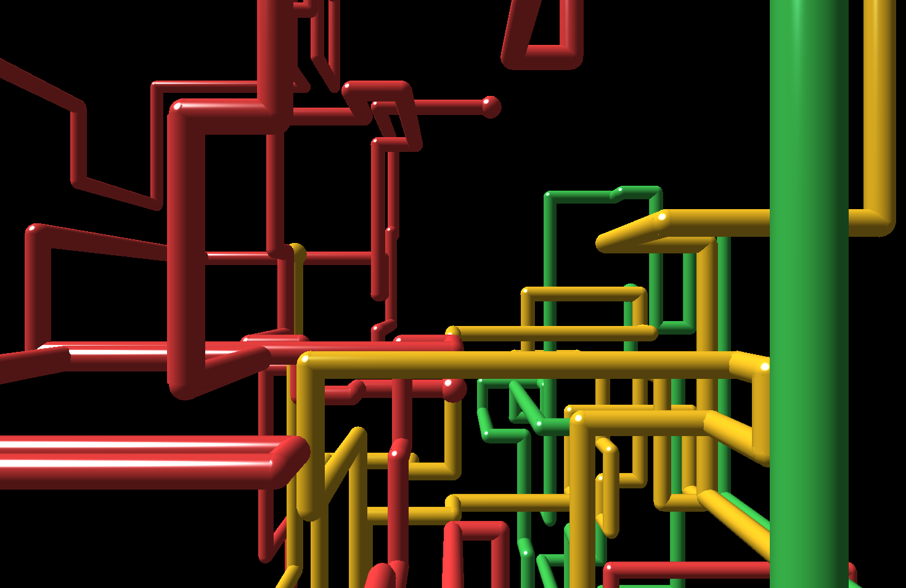
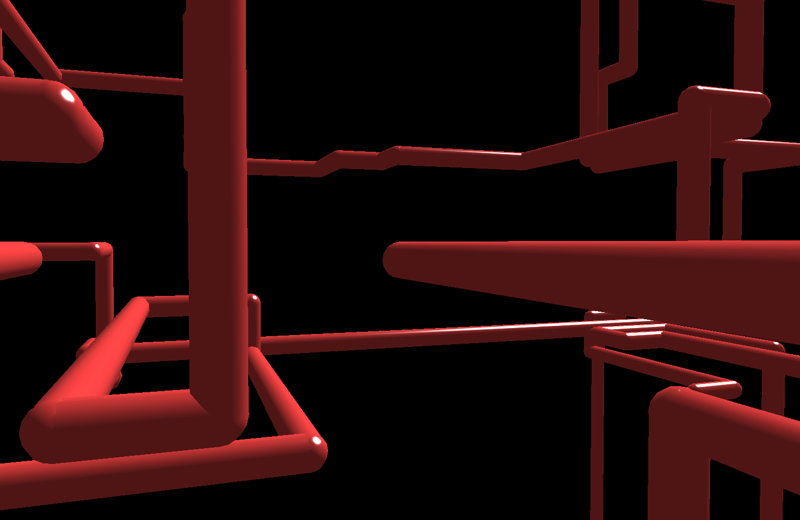

# 3D Pipes screen saver for macOS

**The classic Windows 95 / NT / XP "3D Pipes" screen saver, rebuilt natively for modern macOS.**
Pixel-for-pixel faithful to the original's look and behaviour, and cheap enough to leave on
all day: about **1.7% of one CPU core at full resolution**, no GPU shading, no web view,
no helper processes.



- Works on **macOS 14 Sonoma, 15 Sequoia and macOS 26**, Apple Silicon and Intel (universal binary)
- **Nostalgia-accurate**: the same growth rules, four-colour palette, elbow and ball joints,
  the random camera views, the square dissolve wipe, and yes, the **1-in-200 Utah teapot**
- **Efficient by design**: a tiny software renderer draws only the new pipe segments each
  frame into a persistent framebuffer, and hands the compositor zero-copy IOSurfaces
- **Verified**: a comparison harness renders the same random seed in the reference
  implementation and here, and diffs the images (99.8% of pixels identical, the rest
  within two 8-bit steps)
- **Robust on modern macOS**: works around the macOS 14+ screen saver host never stopping
  or releasing third-party savers, so it does not keep rendering after you come back

## Install

1. Download `Pipes.saver.zip` from the [latest release](https://github.com/CharlesMod/pipes-saver/releases/latest) and unzip it.
2. Double-click `Pipes.saver` (or copy it to `~/Library/Screen Savers/`).
3. Open **System Settings › Screen Saver** and pick **3D Pipes**.

The bundle is ad-hoc signed, not notarised, so on first use macOS may say it cannot verify the
developer. Either right-click the bundle and choose **Open**, or clear the quarantine flag:

```bash
xattr -dr com.apple.quarantine ~/Library/Screen\ Savers/Pipes.saver
```

If you are replacing an older version, macOS keeps the previous code loaded until its screen
saver host restarts:

```bash
killall legacyScreenSaver
```

## Build from source

Requires the Xcode Command Line Tools. No Xcode project, no dependencies:

```bash
./build.sh --install
```

That compiles a universal `Pipes.saver` into `build/` and installs it to
`~/Library/Screen Savers/`. `./verify.sh` loads the bundle exactly the way macOS does,
shows it in a window for a few seconds, and prints the frame count and CPU usage.

Every knob is in the `Tuning` enum at the top of `PipesSaverView.swift`: tick rate, pipe colours,
seconds between wipes, teapot odds, and the framebuffer scale (set `targetFramebufferWidth`
to `480` for a chunky, integer-scaled pixel-art look).

## How it stays faithful

This is not an approximation of 3D Pipes; it is a port of the reference implementation,
[Isaiah Odhner's `pipes`](https://github.com/1j01/pipes), which was itself cross-checked
against the Windows NT 4.0 SDK source of the original OpenGL screen saver.

- Same random generator (mulberry32), consumed in the same order, so a seed produces the
  same pipe network, colours, joints and camera in both implementations
- Same meshes: three.js's 10-sided open cylinder, 8×8 sphere, and the 32-patch Utah teapot,
  with the same vertex normals rounded to 32-bit float
- Same camera: a 45° perspective camera, head-on or rotated 90° about a random axis, run
  through the same `lookAt` and orbit-controls maths, quirks included
- Same lighting: Blinn-Phong with the exact terms of the three.js r98 shader, evaluated per
  pixel on interpolated normals, under the same ambient and directional lights
- Same rasterisation model: triangles sampled at pixel centres, `LEQUAL` depth,
  perspective-correct interpolation, no antialiasing

`compare/` contains the scripts that render one seed both ways and diff the results. Across
five seeds at 1470×956 the images agree on 99.75 to 99.92% of pixels exactly, with 9 to 129
mismatched pixels out of 1.4 million, all on silhouette edges.



## How it stays cheap

Most "retro screen saver" ports for the Mac wrap a web page or a full 3D engine and burn a
core or two plus the GPU. This one does not redraw anything: each new segment is rasterised
once into a persistent colour and depth buffer (a few hundred microseconds), and frames reach
the compositor through two IOSurfaces with dirty-rectangle copies, so the GPU only ever
scales one texture. The result is 1.7% of one core at 30 Hz on a 1470×956 display, dropping
further when the pipes get stuck and nothing changes.

## Credits

- Original 3D Pipes by Microsoft (Windows NT 4.0 OpenGL screen saver samples)
- Behavioural port from [`pipes`](https://github.com/1j01/pipes) by Isaiah Odhner, MIT
- Utah teapot tessellation from three.js's `TeapotBufferGeometry` by Eric Haines, MIT;
  teapot data by Martin Newell

MIT licensed. See [LICENSE](LICENSE).

---

*Keywords: 3D Pipes screensaver Mac, Windows XP screensaver for macOS, Windows 95 pipes screen
saver, pipes.scr macOS, retro screensaver Mac, nostalgic screen saver Apple Silicon, low power
screen saver macOS Sonoma Sequoia, native Swift screen saver.*
